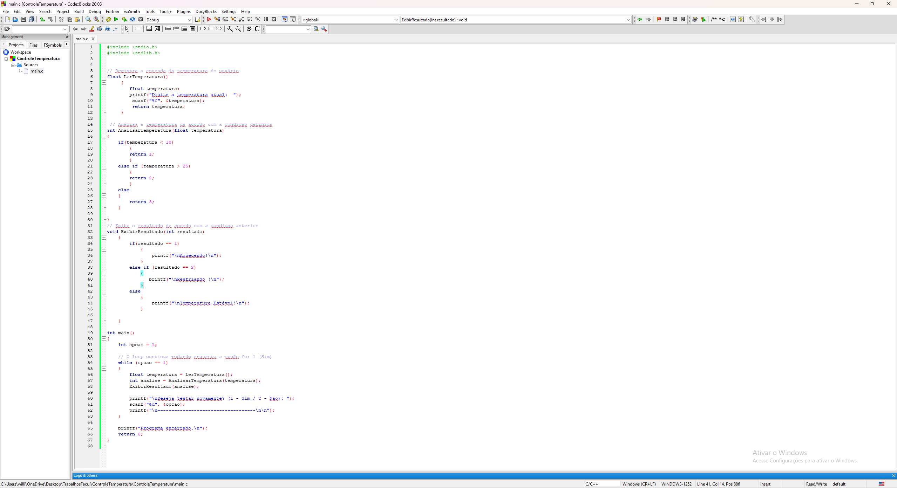

# 🌡️ Controle de Temperatura em C

Sistema modular em linguagem C desenvolvido para leitura, validação e exibição de status de temperatura.

## 📌 Funcionalidades
* **Leitura de dados:** Captura a temperatura informada pelo usuário.
* **Análise condicional:** Classifica a temperatura nas faixas (Aquecendo, Resfriando ou Estável).
* **Interface interativa:** Permite realizar múltiplos testes em sequência através de um menu simples.

## 📸 Demonstração do Funcionamento

---
*Projeto acadêmico desenvolvido em C utilizando o Code::Blocks.*
